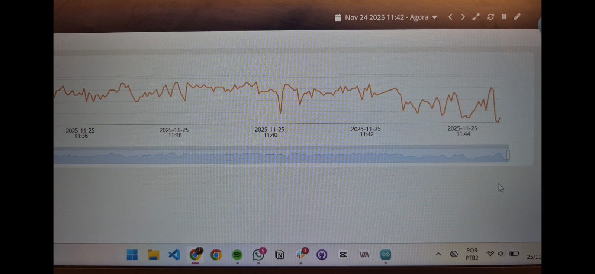
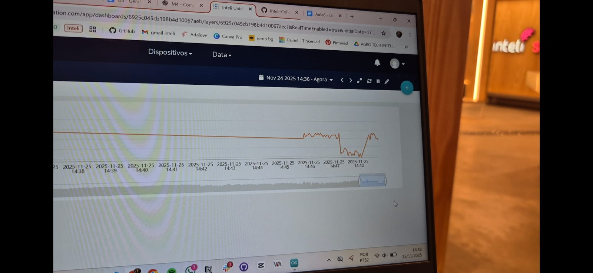
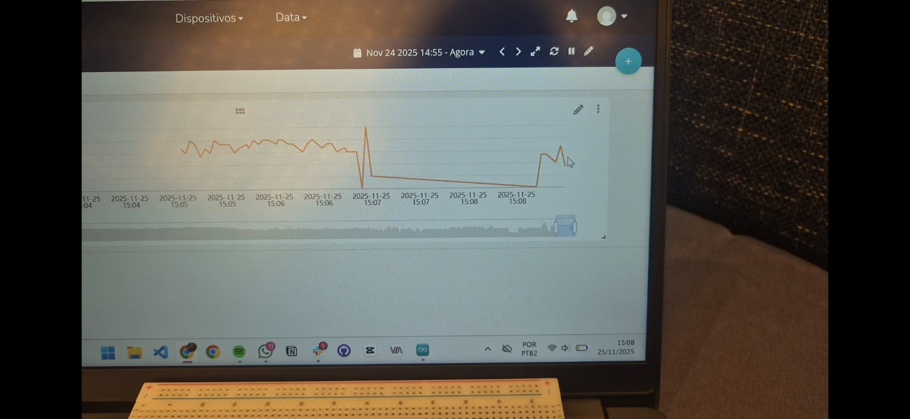
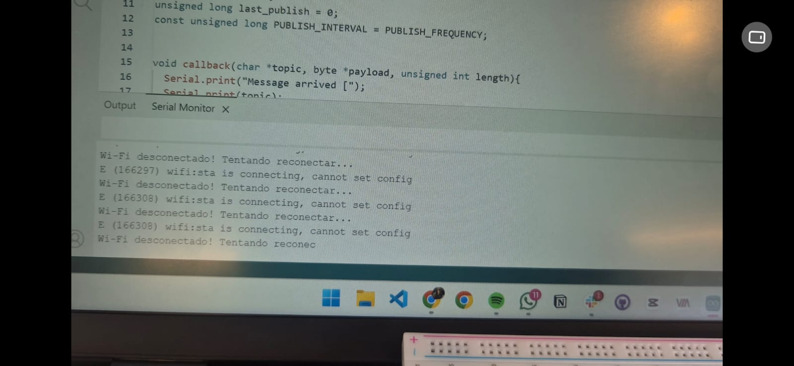
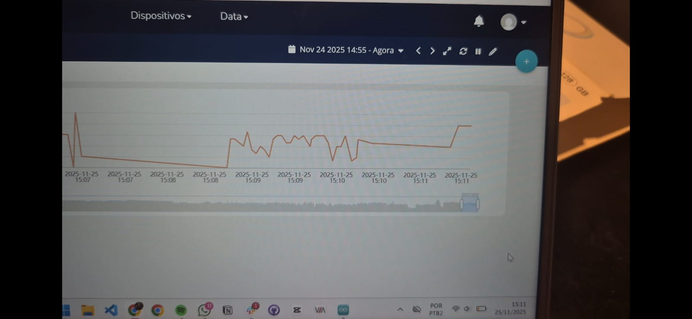
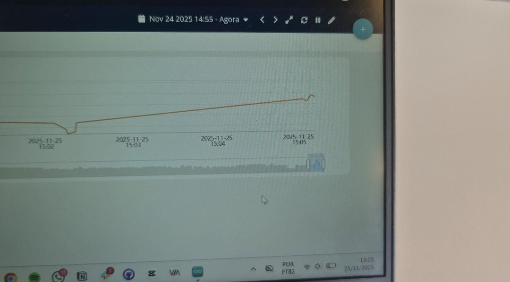
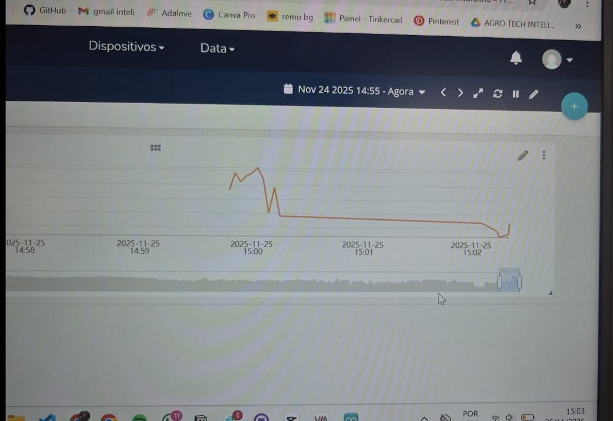

# Ponderada Mapa de Calor - Testes de Sinal (ESP32 + Ubidots)
## 1 - Introdução

Este documento apresenta o registro sistemático dos testes de intensidade de sinal Wi-Fi realizados com o módulo ESP32, utilizando o Ubidots para coleta, visualização e análise dos dados.
O objetivo é verificar como o sinal se comporta em diferentes locais do prédio, identificar pontos de sombra, confirmar perdas dentro do elevador (efeito de gaiola de Faraday) e avaliar a estabilidade da transmissão.

Cada local testado conta com:

- Nome do ambiente

- Confirmação se o envio de dados funcionou

- Imagem do gráfico correspondente

- Considerações e observações importantes

## 2 - Resultados por Local

A seguir, cada ambiente testado com seus respectivos registros.

### 2.1 - Sala de aula: 10 segundos

#### Funcionou?
✔️ Sim

#### Gráfico:

#### Considerações:
Nesse local o monitoramento funcionou corretamente, apesar da demora para carregamento do Esp32 no Arduino IDE e também da perda de conexão com a rede Wi-fi; essa que foi resolvida desconectando o cabo USB, recarregando o _Serial Monitor_ e recarregando, também, a página do _Ubidots_.

### 2.2 - Catraca da Recpção: 10 segundos

#### Funcionou?
✔️ Sim (Com ressalvas)

#### Gráfico:

#### Considerações:
O monitoramento funcionou corretamente, porém, apenas após uma série de tentativas de reconexões, principalmente da próprria rede WI-fi. O registro só foi possível após o seguinte procedimento:

1. Desconexão do cabo USB;
2. Recarregamento do Esp32 no Arduido IDE;
3. Reset do _Serial Monitor_;
4. Reset da plataforma _Ubidots_;
5. Aguardo de, aproximadamente, 5 minutos.

### 2.3 - IT Bar - 10 segundos

#### Funcionou?
✔️ Sim

#### Gráfico:

#### Considerações:
Funcionou normalmente, porém também precisou de reestabelecimento de conexão. Foi retirado o cabo USB e teve recarregamento do Arduino IDE.

### 2.4 - Elevador fechado - 20 segundos

#### Funcionou?
❌ Não

#### Gráfico:

#### Considerações:
O gráfico não gerou resultados. No elevador não foi possível estabelecer todas as conexões novamente (retirar o USB, resetar o _Serial Monitor_ ou a plataforma _Ubidots_).

### 2.5 - Laboratório - 10 segundos

#### Funcionou?
✔️ Sim

#### Gráfico:

#### Considerações:
Funcionou normalmente, sem necessidade de reconexões, apenas as estabelecidas no lugar anterior foram suficientes.

### 2.6 - Final do mesanino 2 - 10 segundos

#### Funcionou?
✔️ Sim

#### Gráfico:

#### Considerações:
Funcionou normalmente, sem necessidade de reconexões, apenas as estabelecidas no lugar anterior foram suficientes.

### 2.7 - Elevador aberto - 10 segundos

#### Funcionou?
✔️ Não

#### Gráfico:

#### Considerações:
O gráfico não gerou resultados. No elevador não foi possível estabelecer todas as conexões novamente (retirar o USB, resetar o _Serial Monitor_ ou a plataforma _Ubidots_).

### 2.8 - Parte externa perto da quadra - 10 segundos

#### Funcionou?
✔️ Não

#### Gráfico:

#### Considerações:
Funcionou depois de diversas reconexões assim como os locais acima, porém de forma mais demorada, por volta de 10 minutos foram necessários até o upload, novamente, do código para o Esp32 e também o reset de todas as plataformas.

3 - Conclusão

Este conjunto de testes permitiu observar o comportamento real do sinal Wi-Fi ao longo do prédio, evidenciando áreas com boa recepção, pontos com degradação moderada e regiões onde a comunicação praticamente se perde, como o interior do elevador.

A análise dos gráficos confirma que o sistema de coleta e transmissão do ESP32 funcionou de forma consistente, permitindo identificar claramente os padrões de queda e recuperação do sinal.
Com essas informações, é possível compreender melhor como barreiras físicas, distância dos roteadores e características estruturais impactam o desempenho da rede e a confiabilidade da leitura.